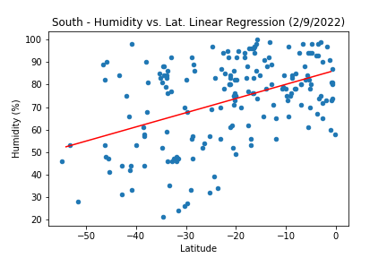
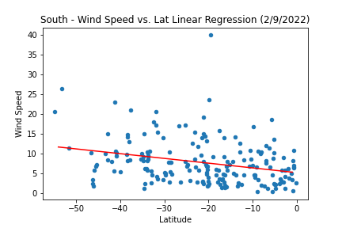

# python-api-challenge
Python requests, APIs, and JSON traversals to answer a fundamental question: "What's the weather like as we approach the equator?"

## Part I - WeatherPy

Creatie a Python script to visualize the weather of 500+ cities across the world of varying distance from the equator. Create a representative model of weather across world cities.

First requirement is to create a series of scatter plots to showcase the following relationships:

After each plot, add a sentence or two explaining what the code is analyzing.

### Scatter Analysis

#### Temperature (F) vs. Latitude

The above scatter plot analyzies the latitudes of cities (north or south) of the equator against their correponding maximum temperatures (in degrees fahrenheit). Temperatures rise the closer a city is in relation to the equator. Cities south of the equator have higher maximum temperatures in comparison to cities north of the equator. 

#### Humidity (%) vs. Latitude

The above scatter plot analyzies percent humidity against the latitudinal of a city in relation to the equator. There seems to be no apparently noticeable relationship between humidity and geolocation.

#### Cloudiness (%) vs. Latitude

The scatter plot of Cloudiness vs. Latitude does does not show any associations between cloud cover and latitudial location.

#### Wind Speed (mph) vs. Latitude

The Wind Speed vs Latitude Scatter Plot shows no apparent associations between wind speed and geolocation for cities north or south of the equator.

second requirement is to run linear regression on each relationship. Separate the plots into Northern Hemisphere (greater than or equal to 0 degrees latitude) and Southern Hemisphere (less than 0 degrees latitude):

After each pair of plots, take the time to explain what the linear regression is modeling. For example, describe any relationships you notice and any other analysis you may have.

### Linear Regression

The northern hemisphere has 383 cities out of 569 total, accounting for 67.3% of cities in the dataset.

The southern hemisphere has 186 cities out of 569 total, accounting for 32.7% of cities in the dataset.

#### Northern Hemisphere - Temperature (F) vs. Latitude

Line of Best-Fit for linear regression is y=-1.44x+97.68
The r-squared correlation coefficient is -0.85

According to the linear regression of maximum temperature vs latitude for the cities in the northern hemisphere, there is a strong negative correlation. The farther away a city's geolocation is to the equator the colder the climate conditions.  

#### Southern Hemisphere - Temperature (F) vs. Latitude

Equation for best-fit linear regression line is y=0.29x+81.08
r-squared correlation coefficient is 0.46

The above linear regression shows a positive relationship between geolocation of cities in the southern hemisphere relative to the equator and their cooresopnding climate conditions. The cities closer to the equator enjoy warmer climate conditions and therefore higher maximum temperatures. 

#### Northern Hemisphere - Humidity (%) vs. Latitude

Equation for best-fit linear regression line is y=0.51x+50.34
r-squared correlation coefficient is 0.44

Dispite the somewhat positive correlation coefficient for the linear regression of Humidity (%) vs. Latitude for cities in the northern hemisphere, the outliers throughout makes the results for this particular dataset skewed. There should not be any noticable correlation between humidity for cities in respect to their geolocation from the equator. 

#### Southern Hemisphere - Humidity (%) vs. Latitude

Equation for best-fit linear regression line is y=0.38x+80.92
r-squared correlation coefficient is 0.25

Likewise there should be little to no assoication between humidity and geolocation for cities in the southern hemisphere.

#### Northern Hemisphere - Cloudiness (%) vs. Latitude

Equation for best-fit linear regression line is y=0.62x+28.74
r-squared correlation coefficient is 0.31

Judging from the overall data spread, there should be little to no correlation between cloud coverage and geolocation for cities in the northern hemisphere. 

#### Southern Hemisphere - Cloudiness (%) vs. Latitude

Equation for best-fit linear regression line is y=1.07x+78.73
r-squared correlation coefficient is 0.38

Similarly, there should also be little to no correlation between cloud coverage and geolocation for cities in the southern hemisphere. 

#### Northern Hemisphere - Wind Speed (mph) vs. Latitude

Equation for best-fit linear regression line is y=0.08x+5.34
r-squared correlation coefficient is 0.23

According to the the correlation coefficient for the linear regression for Wind Speed (mph) vs. Latitude, there should be almost no or slightly weak positive correlation between wind speed and geolocation away from the equator. This data could be skewed by the outliers for a few very windy northern cities. 

#### Southern Hemisphere - Wind Speed (mph) vs. Latitude

Equation for best-fit linear regression line is y=-0.08x+6.31
r-squared correlation coefficient is -0.19

Reasonably should also not be any association between wind speed and geolocation away from the equator for cities in the southern hemisphere.  

#### Final notebook must have:

* Randomly select **at least** 500 unique (non-repeat) cities based on latitude and longitude.
* Perform a weather check on each of the cities using a series of successive API calls.
* Include a print log of each city as it's being processed with the city number and city name.
* Save a CSV of all retrieved data and a PNG image for each scatter plot.

### Part II - VacationPy

Use your skills in working with weather data to plan future vacations. Use jupyter-gmaps and the Google Places API for this part of the assignment.

* Create a heat map that displays the humidity for every city from Part I.

  

* Narrow down the DataFrame to find your ideal weather condition. For example:

  * A max temperature lower than 80 degrees but higher than 70.

  * Wind speed less than 10 mph.

  * Zero cloudiness.

  * Drop any rows that don't contain all three conditions. You want to be sure the weather is ideal.

  Adjust to your specifications but be sure to limit the number of rows returned by your API requests to a reasonable number.

  * Using Google Places API to find the first hotel for each city located within 5000 meters of your coordinates.

* Plot the hotels on top of the humidity heatmap with each pin containing the **Hotel Name**, **City**, and **Country**.

  

  final considerations:

* You must complete your analysis using a Jupyter notebook.
* You must use the Matplotlib or Pandas plotting libraries.
* For Part I, you must include a written description of three observable trends based on the data.
* For Part II, you must include a screenshot of the heatmap you create and include it in your submission.
* You must use proper labeling of your plots, including aspects like: Plot Titles (with date of analysis) and Axes Labels.
* For max intensity in the heat map, try setting it to the highest humidity found in the data set.

## Hints and Considerations

* The city data you generate is based on random coordinates as well as different query times. As such, your outputs will not be an exact match to the provided starter notebook.

* If you'd like a refresher on the geographic coordinate system, [this site](http://desktop.arcgis.com/en/arcmap/10.3/guide-books/map-projections/about-geographic-coordinate-systems.htm) has great information.

* Next, spend the requisite time necessary to study the OpenWeatherMap API. Based on your initial study, you should be able to answer basic questions about the API: Where do you request the API key? Which Weather API in particular will you need? What URL endpoints does it expect? What JSON structure does it respond with? Before you write a line of code, you should be aiming to have a crystal clear understanding of your intended outcome.

* A starter code for Citipy has been provided. However, if you're craving an extra challenge, push yourself to learn how it works: [citipy Python library](https://pypi.python.org/pypi/citipy). Before you try to incorporate the library into your analysis, start by creating simple test cases outside your main script to confirm that you are using it correctly. Too often, when introduced to a new library, students get bogged down by the most minor of errors -- spending hours investigating their entire code -- when, in fact, a simple and focused test would have shown their basic utilization of the library was wrong from the start. Don't let this be you!

* Part of our expectation in this challenge is that you will use critical thinking skills to understand how and why we're recommending the tools we are. What is Citipy for? Why would you use it in conjunction with the OpenWeatherMap API? How would you do so?

* In building your script, pay attention to the cities you are using in your query pool. Are you getting coverage of the full gamut of latitudes and longitudes? Or are you simply choosing 500 cities concentrated in one region of the world? Even if you were a geographic genius, simply rattling 500 cities based on your human selection would create a biased dataset. Be thinking of how you should counter this. (Hint: Consider the full range of latitudes).

* Once you have computed the linear regression for one chart, the process will be similar for all others. As a bonus, try to create a function that will create these charts based on different parameters.

* Remember that each coordinate will trigger a separate call to the Google API. If you're creating your own criteria to plan your vacation, try to reduce the results in your DataFrame to 10 or fewer cities.

* Ensure your repository has regular commits and a thorough README.md file.